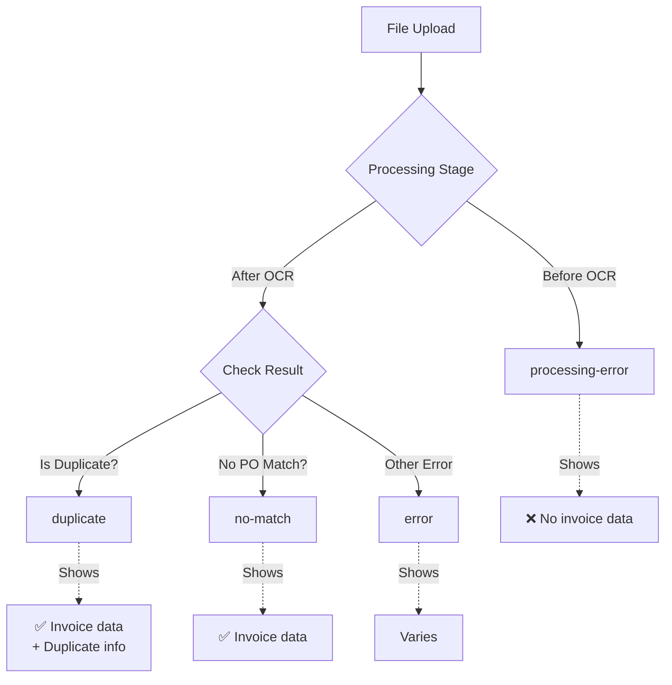

# Upload Status Error States - Visual Guide

## Quick Visual Comparison

### 🔴 Processing Error (`processing-error`)
```
┌─────────────────────────────────────────────────────────┐
│ [X] corrupted-file.pdf                    [Error]       │
│     Unable to extract text from this document.          │
│     The file may be corrupted...                        │
│                                                          │
│     📎 View original file: corrupted-file.pdf           │
│                                                          │
│     [Remove file] [Get help from team]                  │
└─────────────────────────────────────────────────────────┘
```
**Icon**: `XCircle` (red)  
**Shows**: Filename, error message only  
**Data**: ❌ No invoice data (failed before OCR)

---

### 📋 Duplicate (`duplicate`)
```
┌─────────────────────────────────────────────────────────┐
│ [📋] Invoice by Acme Corporation          [Duplicate]   │
│      Already uploaded as "invoice-original.pdf"         │
│      on Mar 10, 2024                                    │
│                                                          │
│      Fastener nuts assortment including SPAC HGLF...    │
│      Mar 15, 2024 • $2,450.00                           │
│                                                          │
│     📎 View original file: invoice-march-2024.pdf       │
│                                                          │
│     [Remove file] [Get help from team]                  │
└─────────────────────────────────────────────────────────┘
```
**Icon**: `Copy01` (red)  
**Shows**: Invoice details + duplicate info  
**Data**: ✅ Full invoice data available

---

### 🔗 No Match (`no-match`)
```
┌─────────────────────────────────────────────────────────┐
│ [🔗] Invoice by Acme Corporation          [No Match]    │
│      Could not find matching PO in AIM                  │
│                                                          │
│      Fastener nuts assortment including SPAC HGLF...    │
│      Mar 15, 2024 • $2,450.00                           │
│                                                          │
│     📎 View original file: invoice-march-2024.pdf       │
│                                                          │
│     [Remove file] [Get help from team]                  │
└─────────────────────────────────────────────────────────┘
```
**Icon**: `LinkBroken01` (red)  
**Shows**: Invoice details  
**Data**: ✅ Full invoice data available

---

### ❌ Generic Error (`error`)
```
┌─────────────────────────────────────────────────────────┐
│ [X] invoice-march-2024.pdf                [Error]       │
│     Unable to extract text from this document.          │
│     The file may be corrupted...                        │
│                                                          │
│     📎 View original file: invoice-march-2024.pdf       │
│                                                          │
│     [Remove file] [Get help from team]                  │
└─────────────────────────────────────────────────────────┘
```
**Icon**: `XCircle` (red)  
**Shows**: Filename, error message  
**Data**: Varies (backward compatibility)

---

## Error State Decision Flow



## When to Use Each State

### Use `processing-error` when:
- ❌ File upload failed
- ❌ PDF is corrupted or unreadable
- ❌ OCR service unavailable
- ❌ Document format not supported
- **Key**: No invoice data was extracted

### Use `duplicate` when:
- ✅ File hash matches existing file
- ✅ Invoice number already exists
- ✅ You have the original file information
- **Key**: Show both invoice data AND duplicate information

### Use `no-match` when:
- ✅ OCR succeeded
- ✅ Invoice data extracted
- ❌ Could not find matching PO in AIM
- ❌ Vendor not in system
- **Key**: Show invoice data, but matching failed

### Use `error` when:
- 🤷 Generic/unspecified error
- 🔄 Backward compatibility needed
- **Key**: Fallback for all other errors

## Data Requirements

| State | Filename | Invoice Info | Duplicate Info | Error Message |
|-------|----------|--------------|----------------|---------------|
| `processing-error` | ✅ Required | ❌ Not shown | ❌ Not used | ✅ Required |
| `duplicate` | ✅ Required | ✅ Shown if available | ✅ Shown if available | ❌ Not used |
| `no-match` | ✅ Required | ✅ Required | ❌ Not used | ❌ Not used |
| `error` | ✅ Required | ❌ Not shown | ❌ Not used | ✅ Optional |

## Code Examples by Scenario

### Scenario 1: File corrupted during upload
```typescript
<UploadStatusCard
  status="processing-error"
  filename="corrupted.pdf"
  errorMessage="File is corrupted or unreadable"
  onRemove={handleRemove}
  onGetHelp={handleGetHelp}
/>
```

### Scenario 2: Duplicate invoice detected with data
```typescript
<UploadStatusCard
  status="duplicate"
  filename="invoice-2024.pdf"
  invoiceInfo={{
    vendor: "Acme Corp",
    date: "Mar 15, 2024",
    amount: "$2,450.00",
    description: "Fastener nuts assortment",
    daysAgo: 5
  }}
  duplicateInfo={{
    originalFilename: "invoice-2024-original.pdf",
    uploadedDate: "Mar 10, 2024"
  }}
  onRemove={handleRemove}
  onGetHelp={handleGetHelp}
/>
```

### Scenario 3: OCR succeeded but no PO match
```typescript
<UploadStatusCard
  status="no-match"
  filename="invoice-2024.pdf"
  invoiceInfo={{
    vendor: "Unknown Vendor",
    date: "Mar 15, 2024",
    amount: "$2,450.00",
    description: "Items not in system",
    daysAgo: 5
  }}
  onRemove={handleRemove}
  onGetHelp={handleGetHelp}
/>
```

### Scenario 4: Unknown error (fallback)
```typescript
<UploadStatusCard
  status="error"
  filename="invoice-2024.pdf"
  errorMessage="An unexpected error occurred"
  onRemove={handleRemove}
  onGetHelp={handleGetHelp}
/>
```

## Icon Visual Reference

| State | Icon | Color | Visual |
|-------|------|-------|--------|
| `processing-error` | `XCircle` | Red | ❌ Circle with X |
| `duplicate` | `Copy01` | Red | 📋 Two overlapping sheets |
| `no-match` | `LinkBroken01` | Red | 🔗 Broken chain link |
| `error` | `XCircle` | Red | ❌ Circle with X |

## Success with Issues (Bonus)

Not an error state, but updated to work better:

```
┌─────────────────────────────────────────────────────────┐
│ [⚠] Invoice by Acme Corporation           [Complete]    │
│     Everything is in order, but:                        │
│                                                          │
│     ⚠ This invoice is 45 days old                       │
│     ⚠ No matching PO found in the system                │
│     ⚠ Vendor address differs from records               │
│                                                          │
│     Fastener nuts assortment including SPAC HGLF...     │
│     Mar 15, 2024 • $2,450.00                            │
│                                                          │
│     📎 View original file: invoice-march-2024.pdf       │
│                                                          │
│     [Export to AIM] [Cancel]                            │
└─────────────────────────────────────────────────────────┘
```

```typescript
<UploadStatusCard
  status="success-with-caveats"
  filename="invoice-2024.pdf"
  invoiceInfo={{ ... }}
  issues={[  // ← Changed from 'caveats' to 'issues'
    "This invoice is 45 days old",
    "Vendor address differs from records"
  ]}
  onExport={handleExport}
  onCancel={handleCancel}
/>
```

## Testing

View all states live at:
```
http://localhost:3000/upload-status-demo
```

All states are rendered with proper data and visual styling!


